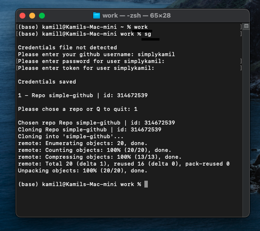

# simple-github
Simple command line interface for github
# capabilities
- clone
# credentials
on first start the script will ask you for credentials which will get saved

# ease of access
for ease of access create an alias
- open terminal
- open .bash_profile or create ('touch .bash_profile') if doesn't exist

- first alias on the image points to the shell file
- reload the profile

- do the same for .zprofile

# hide the folder
hide the folder with 'mv simple-github .simple-github' so mere mortals cannot see it

# running the script
- cd into your base directory / work directory (i have an alias 'work' for it)
- type 'sg'

- that will clone it to your base / working directory (for me it's 'work')

# ENJOY
